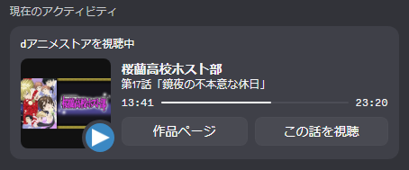

# dアニメ Discord Presence+

[](./License.txt)

dアニメストアで再生中の作品情報を、Discord の Rich Presence（視聴ステータス）に表示する Chrome 拡張 ＋ Native Messaging Host です。

[kitashimauni/d_anime_discord_presence](https://github.com/kitashimauni/d_anime_discord_presence)（MIT）の派生版です。

<p align="center">
  
</p>

## できること

- 作品名の表示
- 話数 ＋ サブタイトルの表示
- 再生進捗の表示
- 作品サムネイルの表示（拡張の設定で OFF 可）

## 必要なもの

1. Google Chrome
2. Discord デスクトップアプリ
3. この Chrome 拡張
4. ネイティブホスト（拡張だけでは動きません）

## 利用者向けセットアップ（Windows）

### 1. Chrome 拡張を入れる

Chrome Web Store から「dアニメ Discord Presence+」をインストールしてください。  
（開発中は `chrome://extensions` → デベロッパーモード → `extension` フォルダを読み込みでも可）

### 2. ネイティブホストを入れる

PowerShell でリポジトリをクローンし、次を実行します。

```powershell
git clone https://github.com/MametaroGG/d_anime_discord_presence.git
cd d_anime_discord_presence
cargo build --release
.\installer\windows-plus.ps1 -DiscordAppId "<あなたのDiscord Application ID>" -ExtensionId "<Chrome拡張のID>"
```

- **Discord Application ID** … [Developer Portal](https://discord.com/developers/applications) で作成したアプリの ID  
- **Extension ID** … `chrome://extensions` で拡張の ID を表示した値

> Rich Presence → Art Assets に `presence_icon`（`assets/presence_icon.png`）をアップロードしておくと、サムネ取得失敗時のフォールバックになります。

### 3. 使う

1. Discord を起動する
2. dアニメストアで再生する
3. プレイヤーの時間表示をクリックし、`現在の時間 / 総時間` の形式にする
4. Discord のプロフィールで Presence を確認する

## 設定

拡張の詳細 → **拡張機能のオプション**

- サムネイル表示の ON / OFF

## 仕組み

1. Chrome 拡張が dアニメストア再生ページから作品情報を取得
2. Native Messaging でローカルのホストアプリへ送信
3. ホストが Discord デスクトップアプリへ Rich Presence を更新

視聴データは開発者のサーバーへ送信しません。処理はローカルの Chrome / ホスト / Discord 間で完結します。

## ドキュメント

| 内容 | リンク |
|------|--------|
| プライバシーポリシー | https://mametarogg.github.io/d_anime_discord_presence/store/privacy-policy.html |
| 利用規約 | https://mametarogg.github.io/d_anime_discord_presence/store/terms.html |
| Chrome Web Store 公開手順 | [RELEASE.md](./RELEASE.md) |
| ストア掲載文案 | [store/listing.md](./store/listing.md) |

## 開発者向け

```powershell
cargo build --release
.\installer\windows-plus.ps1 -UseFallback
```

1. `chrome://extensions` でデベロッパーモードをオン
2. 「パッケージ化されていない拡張機能を読み込む」→ `extension`
3. 表示された拡張 ID を `windows-plus.ps1 -ExtensionId ...` に指定して入れ直す
4. Discord を起動して動作確認

ストア提出用 zip の作成:

```powershell
.\installer\pack-store.ps1
```

## 元プロジェクトとの違い

| 項目 | 元リポジトリ | 本フォーク |
|------|-------------|------------|
| サブタイトル | なし | あり |
| サムネイル | なし | あり（設定で OFF 可） |
| Discord App ID | 固定 | `config.json` で指定 |
| 利用規約 / プライバシー | — | GitHub Pages で公開 |

## License

MIT License（元リポジトリのライセンスを継承）

- Original: [kitashimauni/d_anime_discord_presence](https://github.com/kitashimauni/d_anime_discord_presence)
- This fork: [MametaroGG/d_anime_discord_presence](https://github.com/MametaroGG/d_anime_discord_presence)

本プロジェクトは dアニメストア / Discord の非公式ツールです。各公式サービスとは無関係です。
