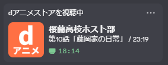

# dアニメ Discord Presence+

[](./License.txt)

dアニメストアで再生中の作品情報を、Discord の Rich Presence（視聴ステータス）に表示する Chrome 拡張 ＋ Native Messaging Host です。

[kitashimauni/d_anime_discord_presence](https://github.com/kitashimauni/d_anime_discord_presence)（MIT）の派生版です。

<p align="center">
  
  &nbsp;
  
</p>

## できること

- 作品名の表示
- 話数 ＋ サブタイトルの表示
- 再生進捗の表示
- 作品サムネイルの表示（拡張の設定で OFF 可）

## インストール（Windows）

Discord Application ID や拡張 ID の準備は不要です。次の 2 つだけで使えます。

### 1. Chrome 拡張を入れる

Chrome Web Store から「dアニメ Discord Presence+」をインストールして有効化します。

### 2. ネイティブホストを入れる

PowerShell で次を実行します（管理者権限は不要です）。

```powershell
iwr "https://raw.githubusercontent.com/MametaroGG/d_anime_discord_presence/main/installer/windows.ps1" | iex
```

完了後、Chrome を再起動してください。

### 3. 使う

1. Discord デスクトップアプリを起動する
2. dアニメストアでアニメを再生する
3. プレイヤーの時間表示をクリックし、`現在の時間 / 総時間` の形式にする
4. Discord のプロフィールで Presence を確認する

## 設定

拡張の詳細 → **拡張機能のオプション**

- サムネイル表示の ON / OFF

## 仕組み

1. Chrome 拡張が dアニメストア再生ページから作品情報を取得
2. Native Messaging でローカルのホストアプリへ送信
3. ホストが Discord デスクトップアプリへ Rich Presence を更新

視聴データは開発者のサーバーへ送信しません。処理はローカルの Chrome / ホスト / Discord 間で完結します。

## ドキュメント

| 内容 | リンク |
|------|--------|
| プライバシーポリシー | https://mametarogg.github.io/d_anime_discord_presence/store/privacy-policy.html |
| 利用規約 | https://mametarogg.github.io/d_anime_discord_presence/store/terms.html |
| Chrome Web Store 公開手順（配布者向け） | [RELEASE.md](./RELEASE.md) |
| ストア掲載文案 | [store/listing.md](./store/listing.md) |

## 開発者・配布者向け

ローカルビルドからのインストール:

```powershell
cargo build --release
.\installer\windows-plus.ps1
```

ストア提出用 zip:

```powershell
.\installer\pack-store.ps1
```

利用者向けワンライナー（`installer/windows.ps1`）は、配布側の Discord App ID と拡張 ID を埋め込んでいます。  
ID を変更した場合は `installer/windows.ps1` を更新し、GitHub Releases に `.exe` を公開してください。

## 元プロジェクトとの違い

| 項目 | 元リポジトリ | 本フォーク |
|------|-------------|------------|
| サブタイトル | なし | あり |
| サムネイル | なし | あり（設定で OFF 可） |
| 利用者の Discord App 作成 | 不要（配布側で用意） | 不要（配布側で用意） |
| 利用規約 / プライバシー | — | GitHub Pages で公開 |

## License

MIT License（元リポジトリのライセンスを継承）

- Original: [kitashimauni/d_anime_discord_presence](https://github.com/kitashimauni/d_anime_discord_presence)
- This fork: [MametaroGG/d_anime_discord_presence](https://github.com/MametaroGG/d_anime_discord_presence)

本プロジェクトは dアニメストア / Discord の非公式ツールです。各公式サービスとは無関係です。
